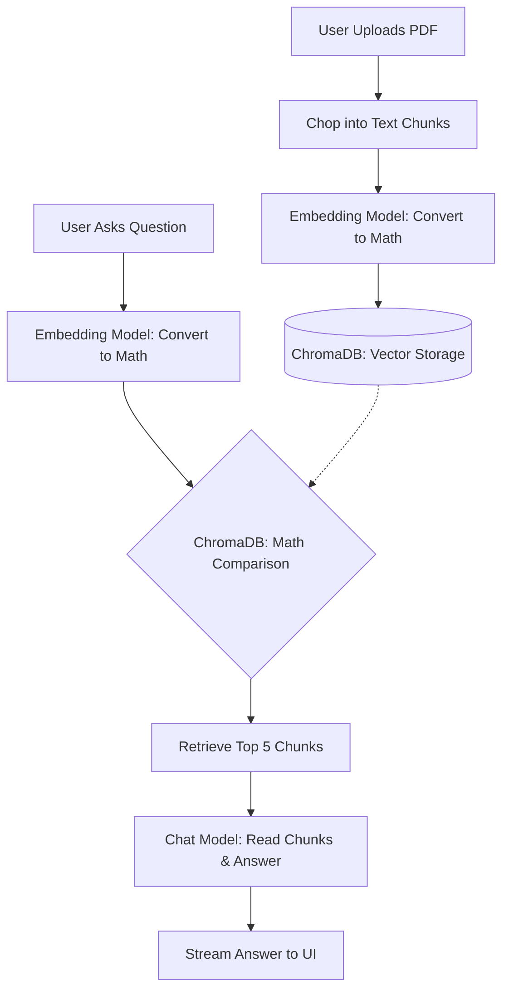

# PDF-QA Architecture & Data Flow

This document explains the "magic" behind the PDF-QA system in simple, powerful language. It breaks down exactly what happens when you upload a PDF, how it answers your questions, and what actually changes under the hood when you switch AI models.

---

## 1. The Core Process: How It Works

At its heart, this application uses a pattern called **RAG (Retrieval-Augmented Generation)**. It gives an AI a "short-term memory" of your specific documents before asking it to answer a question.

Here is the step-by-step lifecycle of your data:

### Phase 1: Uploading a PDF (Ingestion)
When you drop a PDF into the application, the system prepares it for the AI.

1. **Extraction:** The backend reads the raw text from your PDF.
2. **Chunking:** Because AI models have a limited "attention span" (context window), we chop your 100-page PDF into hundreds of small, overlapping paragraphs called **"chunks"**.
3. **Embedding (Translation):** The system hands these text chunks to an *Embedding Model*. This model acts as a translator, converting human language into pure math (a long list of numbers called a vector). These numbers capture the underlying *meaning* and *context* of the text.
4. **Storage:** These mathematical vectors, along with the original text, are saved permanently into **ChromaDB** (our Vector Database).

### Phase 2: Asking a Question (Retrieval & Generation)
When you type a question into the chat box, the system retrieves the knowledge.

1. **Query Embedding:** Your typed question is sent to the *Embedding Model* and translated into the exact same mathematical language (a vector) as your document chunks.
2. **Similarity Search:** **ChromaDB** rapidly compares the math of your question against the math of all the chunks in its database. It finds the top 5 chunks that are "closest" in meaning to your question.
3. **Augmentation:** The system bundles your original question together with those 5 highly relevant text chunks.
4. **Generation:** This bundled package is sent to the *Chat Model* (the LLM). The system instructs the AI: *"Answer the user's question, but ONLY use the information provided in these 5 text chunks."*
5. **Streaming:** The AI reads the chunks and streams the final, hallucination-free answer back to your screen.

---

## 2. What Happens When You Change Models?

Our application features an **Adapter Pattern**, which makes it "model agnostic." This means the core logic (ChromaDB, Chunking, Chat UI) never changes, no matter whose AI brain you plug into it. 

When you use the dropdown in the UI to switch between models, here is what changes:

### Switching Chat Models (e.g., `gemini-1.5-flash` ➔ `gpt-4o`)
> [!NOTE]  
> Changing the Chat Model only affects **Phase 2 (Generation)**.

- **The Brain Changes:** The system routes your final question and the retrieved chunks to a different company's servers (e.g., from Google to OpenAI). 
- **The Tone Changes:** Different models have different personalities, writing styles, and reasoning capabilities. A "Pro" model might give a deeply analytical answer, while a "Flash" model will be much faster and concise.
- **Your Data Remains intact:** You do NOT need to re-upload your PDFs. ChromaDB still uses the existing math to find the right chunks.

### Switching from Cloud (Gemini) to Local (Ollama)
> [!IMPORTANT]  
> Switching to a local provider like Ollama fundamentally shifts the infrastructure from the Cloud to your CPU/GPU.

- **Total Privacy:** When using Ollama, your PDF text and your chat questions *never leave your computer*. The internet connection is completely bypassed.
- **No Rate Limits:** Cloud providers (like Google's Free Tier) impose limits (e.g., 100 requests per minute). Local models have zero limits—they process as fast as your computer allows.
- **Performance:** Cloud models run on massive supercomputers and stream answers instantly. Local models rely entirely on the strength of your personal machine's hardware.

### What if I change the *Embedding* Model?
> [!WARNING]  
> If you change the **Embedding Model** in the configuration (e.g., from Google's `gemini-embedding-1.0` to Ollama's `nomic-embed-text`), **you must wipe your database and re-upload your PDFs.**

Why? Because different companies use different mathematical formulas to translate text. 
If Google translates your PDF into math, but Ollama translates your question into math, **ChromaDB will be comparing apples to oranges**. The similarity search will fail completely. The database must always speak one consistent mathematical language.

---

## 3. Demystifying Models: What is an Embedding Model?

In the AI world, the word "model" is used broadly, but in our application, we deal with two very different *kinds* of models that work together as a team.

### 1. The Embedding Model (The "Translator")
An Embedding Model does not talk, reason, or generate text. Its ONLY job is to read text and map its *semantic meaning* into a multi-dimensional coordinate space (represented as a giant list of floating-point numbers). 

- **How it works:** Imagine a massive 3D map where words with similar meanings are placed close to each other. "Dog" and "Puppy" are coordinates right next to each other, while "Carburetor" is far away. An embedding model turns whole paragraphs into a single coordinate point on a map that has thousands of dimensions.
- **Why we need it:** Computers are terrible at understanding English, but they are incredibly fast at calculating the distance between two coordinates. Embedding models allow **ChromaDB** to instantly find which paragraphs are mathematically closest to your question.
- **Examples:** Google's `text-embedding-004`, OpenAI's `text-embedding-3-small`, Ollama's `nomic-embed-text`.

### 2. The Generative Model / LLM (The "Talker")
A Large Language Model (LLM) is the "brain" that actually talks to you. It takes a prompt (which we build using your question + the text chunks we retrieved), reasons about the information, and generates a human-like response word by word.

- **Why we need it:** To read the specific facts we retrieved from the PDF and formulate a natural, intelligent answer that perfectly addresses your question.
- **Examples:** Google's `gemini-3.7-flash`, OpenAI's `gpt-4o`, Anthropic's `claude-3-opus`, Ollama's `llama3.2`.

### Summary
If this app were an open-book test:
- **The Embedding Model** is the index at the back of the textbook that tells you exactly which page has the information you need.
- **The Generative Model** is the student who reads that specific page and writes the essay.
